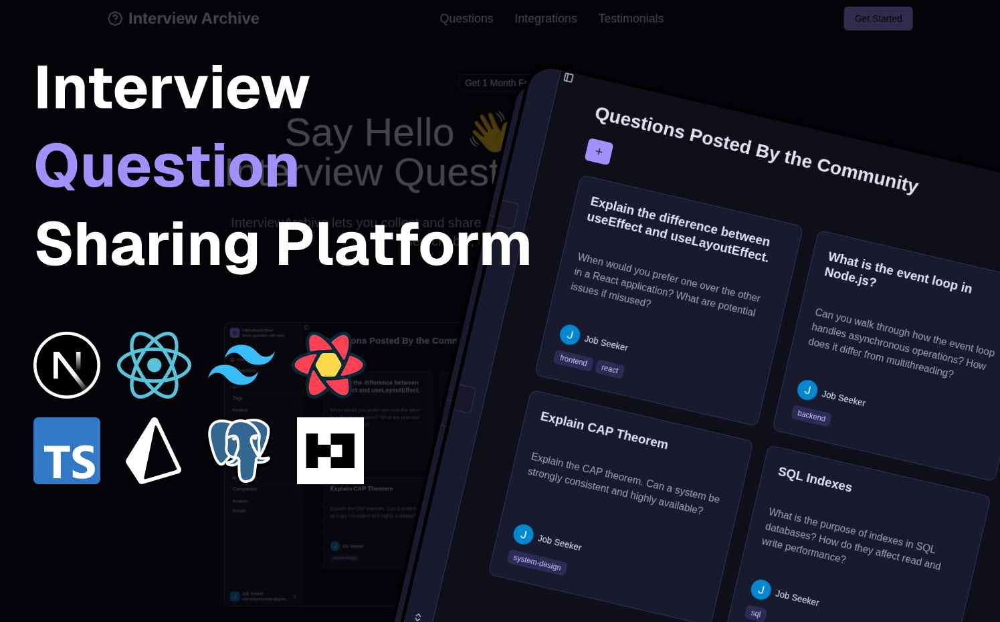

# Interview Archive
> **Share interview questions with ease**

A comprehensive platform for storing, organizing, and sharing interview questions and answers. Built with modern web technologies to help developers prepare for technical interviews and contribute to the community knowledge base.

## Architecture


## Features

- **Question Management**: Create, edit, and organize interview questions with detailed content
- **AI-Powered Answers**: Generate intelligent answers for questions using AI completion
- **Answer Tracking**: Provide and manage user-submitted answers for interview questions
- **Group Collaboration**: Create private groups to share questions and collaborate with team members
- **Invite System**: Invite users to groups using unique invite codes
- **Role-Based Access**: Group membership with different roles (Admin, Moderator, Guest)
- **Tagging System**: Categorize questions with custom tags for easy filtering
- **Company & Role Filtering**: Filter questions by specific companies and job roles
- **File Upload**: Upload images and attachments for questions and groups
- **User Authentication**: Secure user management with Better Auth
- **Responsive Design**: Modern UI built with shadcn/ui components and Tailwind CSS

## Tech Stack

- **Framework**: Next.js 15 with App Router
- **Authentication**: Better Auth
- **Database**: PostgreSQL with Prisma ORM
- **UI**: shadcn/ui components with Tailwind CSS, [MvpBlocks](https://github.com/subhadeeproy3902/mvpblocks)
- **State Management**: Zustand & TanStack Query
- **Type Safety**: TypeScript with Zod validation
- **AI Integration**: AI SDK for intelligent answer generation
- **File Storage**: UploadThing for file uploads

## Getting Started

### Prerequisites

- Node.js 18+
- PostgreSQL database
- pnpm (recommended)

### Installation

1. Clone the repository:

```bash
git clone https://github.com/harsh-m-patil/interview-archive.git
cd interview-archive
```

2. Install dependencies:

```bash
pnpm install
```

3. Set up environment variables:

```bash
cp .env.example .env
```

Configure your database URL and authentication secrets in `.env.local`.

4. Set up the database:

```bash
pnpm prisma migrate deploy
pnpm prisma db seed
```

5. Run the development server:

```bash
pnpm dev
```

Open [http://localhost:3000](http://localhost:3000) to view the application.

## Available Scripts

- `pnpm dev` - Start development server with Turbopack
- `pnpm build` - Build the application for production
- `pnpm start` - Start the production server
- `pnpm lint` - Run ESLint
- `pnpm typecheck` - Run TypeScript type checking

## Database Schema

The application uses a PostgreSQL database with the following main entities:

- **Users**: User accounts and authentication
- **Questions**: Interview questions with content, titles, and AI-generated answers
- **Answers**: User-provided answers to questions
- **Tags**: Categorization system for questions
- **Companies**: Company information for filtering
- **Roles**: Job role information for filtering
- **Groups**: Collaborative spaces for sharing questions within teams
- **Members**: Group membership with role-based access control

## Contributing

1. Fork the repository
2. Create a feature branch (`git checkout -b feature/amazing-feature`)
3. Commit your changes (`git commit -m 'Add amazing feature'`)
4. Push to the branch (`git push origin feature/amazing-feature`)
5. Open a Pull Request
